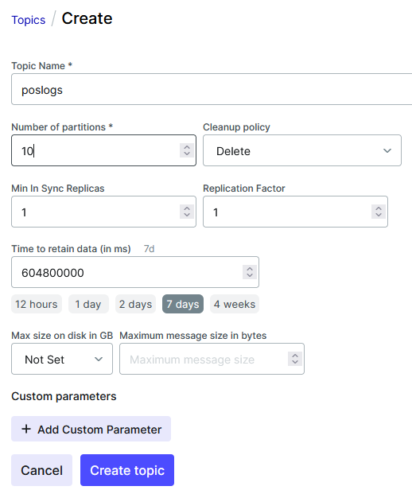
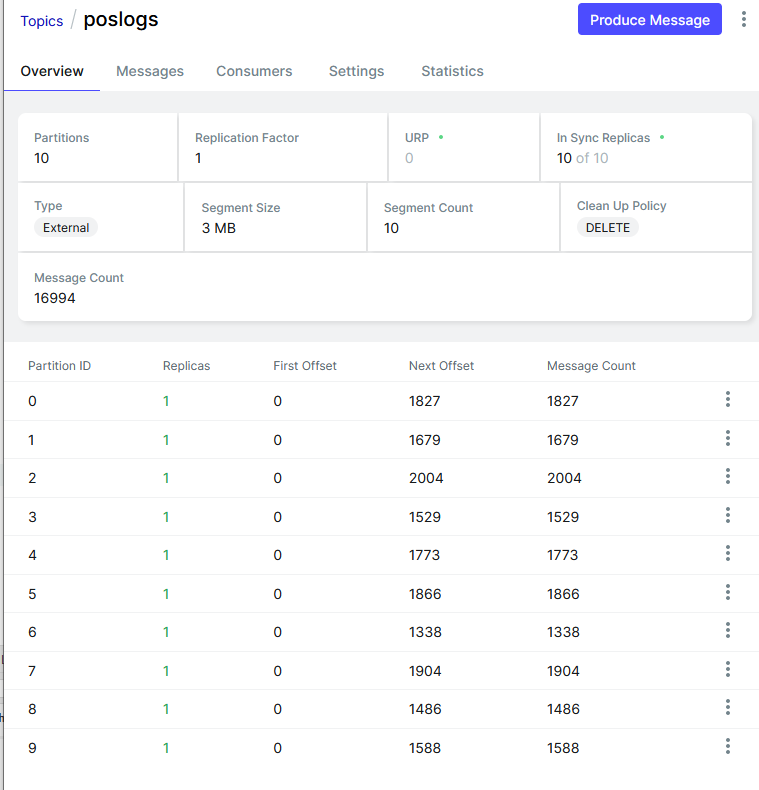

# Введение в Kafka

## Что такое Kafka

Apache Kafka - это [платформа для потоковой передачи событий](https://kafka.apache.org/intro). 

Kafka реализует три ключевые функции:

- Публикация (запись) и подписка (чтение) потоков событий, включая непрерывный импорт/экспорт данных из внешних систем.
- Надёжное хранение событий в течение необходимого срока.
- Обработка потоков событий в режиме реального времени либо ретроспективно.

Apache Kafka - это [распределенный горизонтально масштабируемый отказоустойчивый журнал коммитов](https://habr.com/ru/companies/piter/articles/352978/).

## Cценарии использования

По [ссылке](https://kafka.apache.org/uses) приведены основные сценарии использования Kafka:
1. Очередь сообщений - Kafka может использоваться во всех сферах, в которых применяются традиционные очереди сообщений (как правило, для асинхронного взаимодействия между компонентами системы).
2. Event Sourcing - Kafka хорошо подходит для хранения и передачи событий между микросервисами, спроектированными с Event Sourcing.
3. Stream Processing - потоковая агрегация и обработка сообщений.
4. Агрегация логов.
5. Сбор и агрегация метрик.
6. Отслеживание пользовательской активности.

## Лицензия

[Apache 2.0](https://github.com/apache/kafka/blob/trunk/LICENSE)

## Особенности

- Dumb broker, smart consumer - подписчики Kafka способны самостоятельно определить, к какому из брокеров подключаться, и в случае возникновения отказов способны восстановиться.
- [Kafka не нужны балансировщики нагрузки](https://www.quora.com/Does-Kafka-need-a-load-balancer). Дизайн системы подразумевает, что издателям и подписчикам нужно передать адреса всех брокеров, и клиенты самостоятельно определят, сколько подключений и к какому именно брокеру необходимо создать. Балансировка нагрузки также управляется издателями через указание ключей в сообщениях либо через прямое указание партиций, в которые будут записаны сообщения.
- [Kafka экстенсивно использует файловую систему для хранения и кэширования сообщений](https://kafka.apache.org/documentation/#persistence). Все полученные данные немедленно записываются в файловую систему и попадают в page-кэш.

## Производительность

По [ссылке](https://developer.confluent.io/learn/kafka-performance/) в заголовке приведены результаты бенчмарка, созданного и проведённого Confluent. Бенчмарк показывает:

- Возможности горизонтального масштабирования и отказоустойчивости (бенчмарк был запущен на кластере из трёх брокеров Kafka с трёхкратной репликацией).
- Высокую пропускную способность (утилизация >91% SSD на каждом брокере при нагрузке 640 MB/s).
- Низкую задержку доставки сообщений от издателя подписчику (99% сообщений были доставлены менее чем за 5 ms при нагрузке 200 MB/s).

[Другой бенчмарк](https://www.confluent.io/blog/kafka-fastest-messaging-system/) показывает, что Kafka показывает большую пропускную способность и меньшую задержку, чем RabbitMQ и Apache Pulsar.

## Гарантии доставки

Kafka [поддерживает три вида гарантий доставки сообщений](https://docs.confluent.io/kafka/design/delivery-semantics.html):
- At most once: сообщение доставляется ровно один раз, в случае отказа системы сообщение не пересылается повторно.
- At least once: в случае отказа системы сообщение может быть доставлено несколько раз.
- Exactly once: каждое сообщение доставляется ровно один раз, даже в случае отказа системы (для Kafka Streams).

По умолчанию Kafka гарантирует at least once доставку, поэтому рекомендуется реализовывать идемпотентных подписчиков.

Разделяют доставку от издателя брокеру и от брокера подписчику.

### От издателя

- At most once: издатель отправляет сообщения асинхронно, в режиме "отправил и забыл", либо ожидает подтверждения от лидера. Этот режим обеспечивает наименьшую задержку, но сообщения могут быть не получены брокером при отказе.
- At least once: издатель ожидает подтверждение получения сообщения от брокера. Если подтверждение не поступает, издатель повторно посылает сообщение. Kafka предоставляет издателям опцию идемпотентной отправки: если издатель в режиме at least once повторно отправляет сообщение, которое уже есть в журнале, дубликат сообщения не будет создан.
- Exactly once: издатель использует транзакционную доставку сообщений.  Для использования транзакционных гарантий, потребители также должны обрабатывать сообщения транзакционно. Этот режим увеличивает задержку доставки сообщений.

### Подписчику

- At most once: подписчик читает набор сообщений, сохраняет позицию в журнале и обрабатывает сообщения. Если подписчик падает после сохранения позиции, но до обработки сообщений, подписчик, который начинает работать вместо упавшего, начнёт получать сообщения с сохраненной позиции, и часть сообщений может остаться необработанной.
- At least once: подписчик читает набор сообщений, обрабатывает их и сохраняет позицию в журнале.  Если подписчик падает после обработки сообщений, но до сохранения позиции, подписчик, который начнёт работать вместо упавшего, может обработать сообщения дважды.
- Exactly once: если подписчик читает сообщения из одного топика и отправляет сообщения в другой топик (Kafka Streams), он должен использовать транзакционную доставку сообщений. 

## Основные термины

- Producer/consumer - клиенты, отправляющие/получающие сообщения из Kafka
- Consumer group - подписчики объединяются в группы для балансировки нагрузки между ними
- Topic -  журнал событий. Один топик может иметь множество издателей и множество подписчиков. Топик состоит из партиций, всегда есть как минимум одна партиция. Для каждого топика можно задать количество партиций (не менее 1), фактор репликации (не менее 1) и время жизни сообщений.
- Partition - партиция топика. Одна партиция может иметь только одного подписчика. Партиции являются основным механизмом параллельной обработки сообщений в Kafka. Количество партиций в топике определяет степень параллелизма обработки сообщений.
- Offset - смещение, целое число. Когда в партицию приходит новое сообщение, ему присваивается уникальный идентификатор (последовательность целых чисел, ID нового сообщения = ID предыдущего сообщения + 1). Если группа подписчиков подписана на топик, для каждой партиции этого топика Kafka хранит смещение, определяющее, какое сообщение в партиции было прочитано последним.

## Необходимый софт

- **Docker+WSL2**, чтобы собирать и запускать Linux-контейнеры.
- (опционально) **.NET 7 SDK**, чтобы собирать клиентские приложения.

## Структура решения

- **KafkaConsumer** - простая консольная C# утилита, которая подписывается на топик Kafka "time", логирует каждое полученное сообщение в stdout и ждёт одну секунду, имитируя обработку сообщения.
- **KafkaConsumerWithKey** - то же самое, что KafkaConsumer, но подписывается на топик Kafka "poslogs" и выводит не только тело сообщения, но и ключ, ждёт 0.12 секунд, имитируя обработку сообщения.
- **KafkaProducer** - простая консольная C# утилита, которая каждые 10 секунд публикует простое сообщение, содержащее дату-время создания, в топик Kafka "time", и логирует это в stdout. 
- **KafkaProducerWithKey** - то же самое, что KafkaProducer, но публикует сообщения со случайно выбранным на отрезке [0;500] ключом каждые 0.12 секунд.
- **Screenshots** - скриншоты для ReadMe.md.
- **Scripts** - простейшие Powershell-скрипты для демонстрации работы с Kafka.
- **Shared** - простая C# библиотека, содержащая класс Poslog и сериализатор в JSON. Используется в KafkaConsumerWithKey и KafkaProducerWithKey.
- **compose.yaml** - файл Docker Compose, агрегирующий все необходимые контейнеры.

## Пошаговая демонстрация базовых возможностей

1. Откройте powershell, запустите docker compose с профилем basic.
    ```powershell
    cd kafka_demo
    docker compose --profile basic up
    ```
2. В результате шага 1 должны собраться и запуститься 4 контейнера:
    - kafka-kafka-1 - Kafka
    - kafka-ui-1 - Kafka UI
    - kafka-publisher-1 - KafkaProducer
    - kafka-consumer1-1 - первый KafkaConsumer
    - kafka-consumer2-2 - второй KafkaConsumer

   В Powershell-инстансе, из которого были запущены контейнеры, можно увидеть stdout всех контейнеров, включая издателя и подписчиков:
   ```
   kafka_demo-publisher-1  | [07:36:24 INF] Message sent.
   kafka_demo-consumer2-1  | [07:36:24 INF] Received message 04/24/2023 07:36:24.
   kafka_demo-publisher-1  | [07:36:34 INF] Message sent.
   kafka_demo-consumer2-1  | [07:36:34 INF] Received message 04/24/2023 07:36:34.
   kafka_demo-publisher-1  | [07:36:44 INF] Message sent.
   kafka_demo-consumer2-1  | [07:36:44 INF] Received message 04/24/2023 07:36:44.
   ```
3. Можно заметить, что несмотря на то, что работают два подписчика, только один получает сообщения. Это происходит из-за того, что в Kafka после старта не были созданы никакие топики. Когда издатель отправил первое сообщение в топик time, Kafka автоматически создал топик с одной партицией (эту функцию желательно отключать в продакшне). Только один подписчик может получать сообщения из одной партиции (следовательно, если у нас больше подписчиков, чем партиций, часть подписчиков не будет получать сообщения вообще). Так как у нас работают два подписчика, увеличим количество партиций в топике time до двух:
   ```powershell
   # Содержимое SetPartitionsToTwo.ps1:
   docker exec kafka-kafka-1 /opt/bitnami/kafka/bin/kafka-topics.sh `
       --bootstrap-server kafka:9092 `
       --alter --topic time --partitions 2
   ```
   Может понадобиться некоторое время, чтобы потребитель начал работать с новой партицией. В логах начнут появляться сообщения от двух подписчиков:
   ```
   kafka_demo-publisher-1  | [07:44:44 INF] Message sent.
   kafka_demo-consumer2-1  | [07:44:44 INF] Received message 04/24/2023 07:44:44.
   kafka_demo-publisher-1  | [07:44:54 INF] Message sent.
   kafka_demo-consumer1-1  | [07:44:54 INF] Received message 04/24/2023 07:44:54.
   ```
4. Так как Kafka хранит все полученные сообщения в течение заданного времени (для автоматически созданного топика - 1 неделя по умолчанию, но это можно изменить на дни, месяцы, годы и т. д.), существует возможность "переиграть" все полученные сообщения в топике без необходимости издателям повторно отправлять эти сообщения. Попытаемся сбросить офсеты для всех партиций в топике time: 
   ```powershell
   # Содержимое ReplayMessages.ps1:
   docker exec kafka_demo-kafka-1 /opt/bitnami/kafka/bin/kafka-consumer-groups.sh `
       --bootstrap-server kafka:9092 `
       --group csharp-consumer --reset-offsets --execute --all-topics --to-earliest
   ```
   При попытке выполнения этой команды получим следующую ошибку:   
   ```
   Error: Assignments can only be reset if the group 'csharp-consumer' is inactive, but the current state is Stable.
   ```
   Это означает, что мы должны сперва остановить всех подписчиков в группе csharp-consumer:
   ```powershell
   # Содержимое StopSubscribers.ps1
   docker stop kafka_demo-consumer1-1
   docker stop kafka_demo-consumer2-1
   ```
   Подождём, пока группа csharp-consumer не будет автоматически переведена в состояние EMPTY:
   ```
   kafka_demo-kafka-1      | [2023-04-24 07:59:02,317] INFO [GroupCoordinator 1]: Group csharp-consumer with generation 4 is now empty
   ```
   Попробуем снова сбросить офсеты (ReplayMessages.ps1) и запустить подписчиков (StartSubscribers.ps1), которые начнут повторно получать все ранее отправленные сообщения.
5. Можно заметить, что один подписчик получает больше сообщений, чем другой: 
   ```
   kafka_demo-consumer2-1  | [08:03:10 INF] Received message 04/24/2023 07:50:14.
   kafka_demo-consumer1-1  | [08:03:11 INF] Received message 04/24/2023 08:02:54.
   kafka_demo-consumer2-1  | [08:03:11 INF] Received message 04/24/2023 07:50:44.
   kafka_demo-consumer1-1  | [08:03:12 INF] Received message 04/24/2023 08:03:04.
   kafka_demo-consumer2-1  | [08:03:12 INF] Received message 04/24/2023 07:50:54.
   kafka_demo-consumer2-1  | [08:03:13 INF] Received message 04/24/2023 07:51:14.
   kafka_demo-consumer2-1  | [08:03:14 INF] Received message 04/24/2023 07:51:34.
   kafka_demo-consumer2-1  | [08:03:15 INF] Received message 04/24/2023 07:51:44.
   kafka_demo-consumer2-1  | [08:03:16 INF] Received message 04/24/2023 07:51:54.
   kafka_demo-consumer2-1  | [08:03:17 INF] Received message 04/24/2023 07:52:24.
   kafka_demo-consumer2-1  | [08:03:18 INF] Received message 04/24/2023 07:52:54.
   ```
   Это объясняется тем фактом, что в рамках одной партиции гарантируется хронологический порядок обработки сообщений. До того, как мы увеличили количество партиций в шаге 3, все получаемые сообщения хранились в одной партиции. Следовательно, подписчик, подписанный на первую партицию, получит больше сообщений, чем подписчик, подписанный на вторую. Попробуем сократить количество партиций в топике time с 2 до 1:
   ```powershell
   # Содержимое SetPartitionsToOne.ps1:
   docker exec kafka_demo-kafka-1 /opt/bitnami/kafka/bin/kafka-topics.sh `
       --bootstrap-server kafka:9092 `
       --alter --topic time --partitions 1
   ```
   Получим ошибку:
   ```
   Error while executing topic command : The topic time currently has 2 partition(s); 1 would not be an increase.
   ```
   Сокращение количества партиций привело бы к удалению партиций и, соответственно, к потере сообщений либо к утрате гарантии очерёдности сообщений в одной партиции. В средах разработки можно удалить и пересоздать весь топик, задав меньшее количество партиций - это приведёт к потере ранее отправленных сообщений (см. DeleteTopic.ps1). В продакшн средах такую операцию не стоит выполнять вообще.

6. Взглянем на исходный код издателя (KafkaProducer):
   ```csharp
   using var producer = new ProducerBuilder<Null, string>(config).Build();
   ```
   Первый тип-параметр (Null) соответствует типу ключа сообщения, второй (string) - типу тела сообщения. Null означает, что ни одно сообщение, публикуемое этим продюсером в топик time, не будет содержать ключа. Следовательно, публикуемые сообщения будут равномерно распределяться между партициями топика time и между подписчиками. Такое поведение может быть нежелательно, когда необходимо гарантировать порядок обработки сообщений, т. е. гарантировать, что отправленные сообщения будут помещены в одну партицию. Для этого в отправляемых сообщениях задают непустой ключ. Kafka помещает сообщения с одинаковым ключом в одну партицию. 

## Демонстрация отправки сообщений с ключом

Предположим, что мы разрабатываем систему для торговой сети, где есть 500 магазинов. Сообщения/послоги, отправляемые из одного магазина, обязаны обрабатываться в хронологическом порядке. Мы расчитываем, что нам выделят максимум 10 серверов/виртуальных машин для параллельной обработки послогов.

1. Создадим новый топик "poslogs". Есть много разных способов управления топиками, воспользуемся [UI](http://localhost:8080):  
      
    Выставим количество партиций = 10, так как это наибольшая степень параллелизма, на которую мы расчитываем. Сообщения с одинаковыми ID всегда будут попадать в одну партицию.
2. Перезапустим контейнеры с профилем with_key, чтобы запустить новых издателей/подписчиков:
   ```powershell
   docker compose --profile with_key up
   ```
3. С помощью UI убедимся, что сообщения более-менее равномерно распределяются между партициями:  
   

## Другие фичи

### Безопасность

- SSL/TLS-шифрование данных на лету, позволяющее шифровать данные между отправителями (producer) и потребителями (consumer) Kafka.
- SSL/SASL-аутентификация, которая обеспечивает проверку продюсеров и потребителей в Kafka-кластере, что необходимо для предоставления им соответствующих прав (авторизаций) для доступа к данным.
- ACL-авторизация, когда после проверки подлинности клиентов брокеры Kafka обращаются к спискам управления доступом (ACL, Access Control Lists), чтобы определить, допущен (авторизован) ли конкретный клиент на запись или чтение в какой-либо топик.

### Время жизни сообщений

- Topic compaction: топик может удалять неактивные сообщения, оставляя только последнее сообщение с уникальным ключом. Эту фичу можно использовать совместно с удалением по времени, в таком случае compaction будет применяться только к старым сообщениям.

## Выводы

Kafka - это хороший инструмент, который подходит как для больших enterprise-систем, так и для разработок среднего размера. Высокая производителньость и множество возможностей из коробки позволяют использовать Kafka в распределенных системах с требованиями к высокой доступности и отказоустойчивости. В отличие от традиционных очередей сообщений, Kafka также может выступать как надёжное хранилище данных. К недостаткам Kafka можно отнести концептуальное отличие от очередей сообщений и необходимость разработчикам вникать в менее привычную терминологию.

## Полезные ссылки
   
- [Apache Kafka](https://kafka.apache.org/intro)
- [Клиент Kafka для C# от Confluent](https://docs.confluent.io/kafka-clients/dotnet/current/overview.html)
- [Хабр - Учимся жить с Kafka без Zookeeper](https://habr.com/ru/companies/otus/articles/670440/)